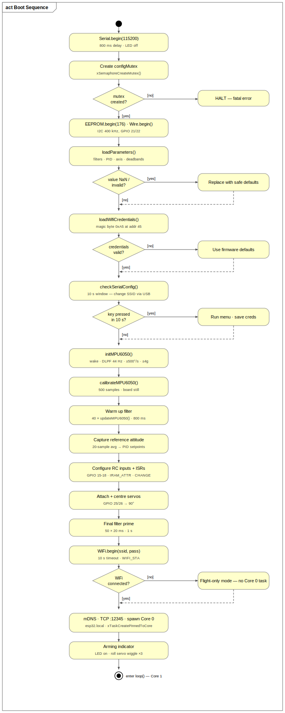
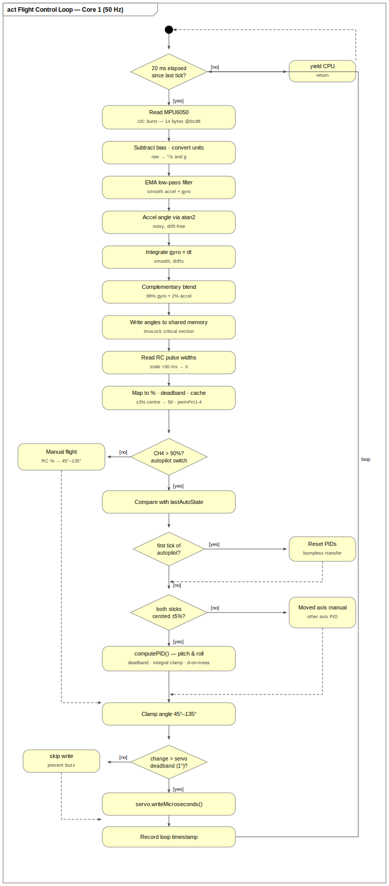
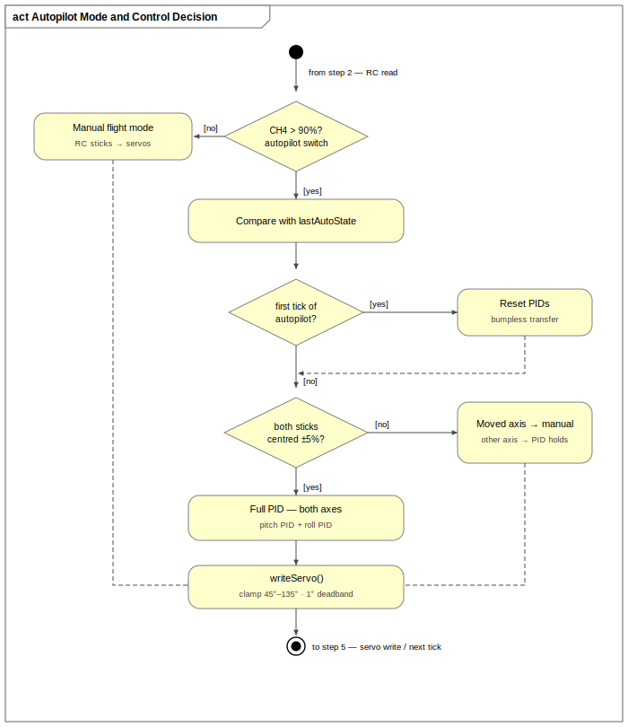
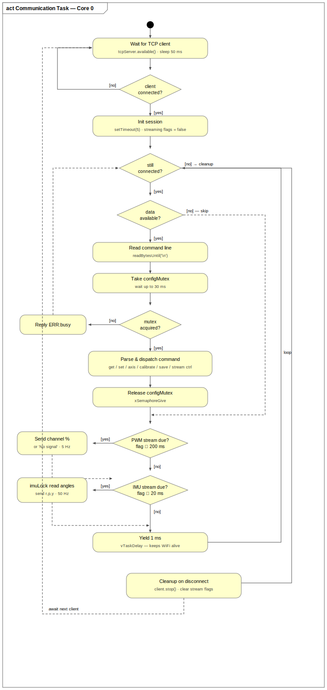
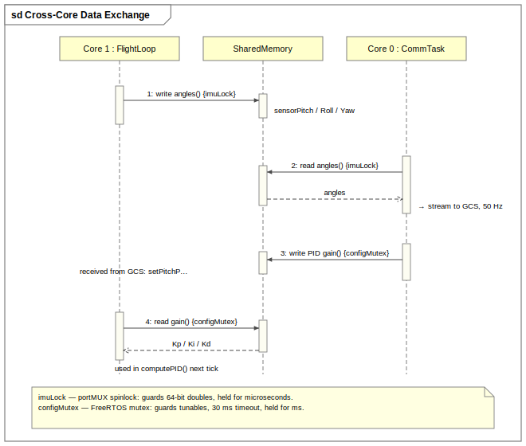

# Firmware

C++ firmware for the ESP32 flight stabilizer, written with the Arduino framework. It uses both cores of the ESP32: Core 1 runs the flight control loop, Core 0 runs the WiFi/TCP communication with the ground station. The two never block each other.

## Features

- 50 Hz control loop with a non-blocking rate gate (20 ms tick)
- MPU6050 sensor fusion with a complementary filter (98% gyro integration, 2% accelerometer correction)
- Separate PID controllers for pitch and roll, with derivative-on-measurement, integral clamping and bumpless transfer
- Interrupt-driven PWM capture on 4 RC channels, no blocking pulseIn() calls
- Axis swap and sign inversion at runtime, so mounting orientation can be fixed without reflashing
- All parameters stored in EEPROM and restored on boot; blank EEPROM falls back to safe defaults
- TCP command server on port 12345, announced over mDNS as `esp32.local`
- Live attitude streaming at 50 Hz and RC channel streaming at 5 Hz
- WiFi credentials changeable through a 10-second serial menu at boot
- Servo output clamped to 45°–135° at all times
- If WiFi fails at boot, the flight loop still runs on its own (flight-only mode)

## Boot sequence

In order:

1. Start serial (115200), create the config mutex, initialize EEPROM and I2C at 400 kHz
2. Load WiFi credentials and all tunable parameters from EEPROM; invalid or blank values are replaced with defaults
3. Wait 10 seconds for a serial keypress. If one arrives, a menu lets you change the WiFi credentials over USB
4. Initialize the MPU6050 (wake it, ±500°/s gyro range, ±4g accel range, 44 Hz low-pass filter)
5. Calibrate the gyro bias: 500 samples averaged over about a second, board must be still
6. Warm up the complementary filter: 40 iterations, 800 ms
7. Capture the reference attitude: 20 readings averaged. This becomes the fixed autopilot setpoint for the whole flight
8. Configure the RC input pins, attach the edge-timing interrupt, attach and centre the servos
9. One more second of filter settling, then connect WiFi
10. If WiFi connects: start mDNS and the TCP server, and create the communication task pinned to Core 0. If not: flight-only mode
11. The roll servo wiggles three times to show setup is complete, then loop() starts

### Why the filter warm-up exists

All the angle variables start at zero, because that's what C++ does with globals. It's not that the sensor reads zero. The complementary filter trusts its previous estimate 98% and the new reading only 2%, so starting from zero it takes around a second to converge on the real attitude. If the reference attitude were captured right away, the autopilot would lock onto a wrong setpoint and lurch the moment it's switched on. The 800 ms warm-up makes sure the estimate has settled before the reference is frozen.

## Flight control loop (Core 1)

Every 20 ms:

1. Rate gate: return immediately unless 20 ms have passed
2. Read the MPU6050 in one 14-byte I2C burst, subtract the gyro bias, smooth with an EMA low-pass filter, compute the accelerometer angle with atan2, integrate the gyro, blend both in the complementary filter, and write the result to shared memory under the imuLock
3. Read the RC channels from the ISR buffers. A channel with no edge for 30 ms counts as no signal. Pulse widths are mapped to 0–100% with a small deadband around centre
4. Check channel 4 for autopilot mode. On the switch-on edge, the PIDs are reset with bumpless transfer so the servos don't jump
5. If both sticks are centred, PID runs on both axes. If the pilot moves one stick, that axis follows the stick and the other stays under PID
6. Clamp the output to 45°–135° and write the servo, but only if the change is more than 1° (stops the servo buzzing on noise)

The mode and control decision in steps 4–5 in detail:

A few PID details worth mentioning:

- The derivative is computed on the measurement, not on the error, which avoids the derivative kick when the setpoint changes
- The integral is clamped to ±50 against wind-up
- Errors below the PID deadband (default 0.8°) are ignored, so sensor noise doesn't keep the servos hunting
- Bumpless transfer: when autopilot engages, the previous measurement is set to the current angle and the integral is back-calculated, so the first output is calm. Same idea as cruise control in a car: it holds your current speed instead of jumping anywhere

## Communication task (Core 0)

The task waits for a TCP client, then reads one newline-terminated command per iteration. Before touching any shared parameter it takes the config mutex (30 ms timeout, otherwise it answers ERR:busy). After the command is handled the mutex is released right away. Then it checks the two stream flags: RC percentages go out every 200 ms if PWM streaming is on, attitude goes out every 20 ms under the imuLock if the HUD stream is on. At the end of every iteration it yields 1 ms to the WiFi stack, which is needed to keep the connection alive. When the client disconnects, the stream flags are cleared and the task goes back to waiting.

## Cross-core synchronization

Two different primitives, on purpose:

| Primitive | Protects | Why |
|---|---|---|
| imuLock (portMUX spinlock) | the three angle doubles | 64-bit doubles can't be read atomically on the Xtensa LX6, so a reader on the other core could get a torn value. The lock is held for microseconds, so spinning is cheaper than a context switch. |
| configMutex (FreeRTOS mutex) | PID gains, filter weights, deadbands, axis config | held for milliseconds while a command is processed (sometimes including EEPROM writes), so a blocking mutex with a timeout is the right tool. |

The RC pulse widths need no lock at all. They are 32-bit aligned integers, which this CPU reads and writes atomically.

One more detail: the RC interrupt handler is marked IRAM_ATTR. The ESP32 runs most code from flash through a cache, and that cache gets disabled during EEPROM commits and some WiFi operations. If the ISR lived in flash and an RC edge arrived in that moment, the chip would crash. IRAM_ATTR puts the handler in internal RAM, which is always reachable.

## TCP protocol

Plain ASCII lines, terminated with \n. Replies are comma-separated values, `OK`, or `ERR:<reason>`. A short overview:

| Command | Reply | Purpose |
|---|---|---|
| `get` | `0.150,0.150,0.980` | read the filter coefficients |
| `setA{v}` `setG{v}` `setC{v}` | `OK` | write filter coefficients |
| `getPitchPID` / `getRollPID` | `1.20,0.05,0.30` | read PID gains |
| `setPitchP/I/D{v}`, `setRollP/I/D{v}` | `OK` | write a PID gain |
| `getStatus` | 9 fields | live angles, mode, axis config |
| `swapAxes`, `invertPitch`, `invertRoll` | `OK` | fix mounting orientation |
| `setPidDB{v}`, `setServoDb{v}` | `OK` | deadbands |
| `calibrate` | `CAL_START` … `CAL_DONE,x,y,z` | gyro calibration |
| `save` | `OK` | write everything to EEPROM |
| `startPWMStream` / `stopPWMStream` | `PWM_STREAM_START` / `OK` | RC stream, 5 Hz |
| `startCubeStream` / `stopCubeStream` | `CUBE_STREAM_START` / `OK` | attitude stream, 50 Hz |

The complete list with example replies is in [`docs/gcs_command_reference.xlsx`](../docs/gcs_command_reference.xlsx).

## EEPROM layout (176 bytes)

| Address | Contents |
|---|---|
| 0-11 | 3 filter floats |
| 12-35 | 6 PID floats (pitch Kp/Ki/Kd, roll Kp/Ki/Kd) |
| 36 | axis config byte (bit 0 swap, bit 1 pitch sign, bit 2 roll sign) |
| 37-44 | PID deadband, servo deadband |
| 45 | WiFi validity magic byte (0xA5) |
| 46-109 | WiFi SSID |
| 110-173 | WiFi password |

## Building

With PlatformIO: open this folder and run `pio run -t upload`. With the Arduino IDE: board "ESP32 Dev Module", and install the ESP32Servo library. Wire, WiFi, ESPmDNS and EEPROM come with the ESP32 core. Default WiFi credentials are compiled in, but you can change them any time through the boot serial menu.
