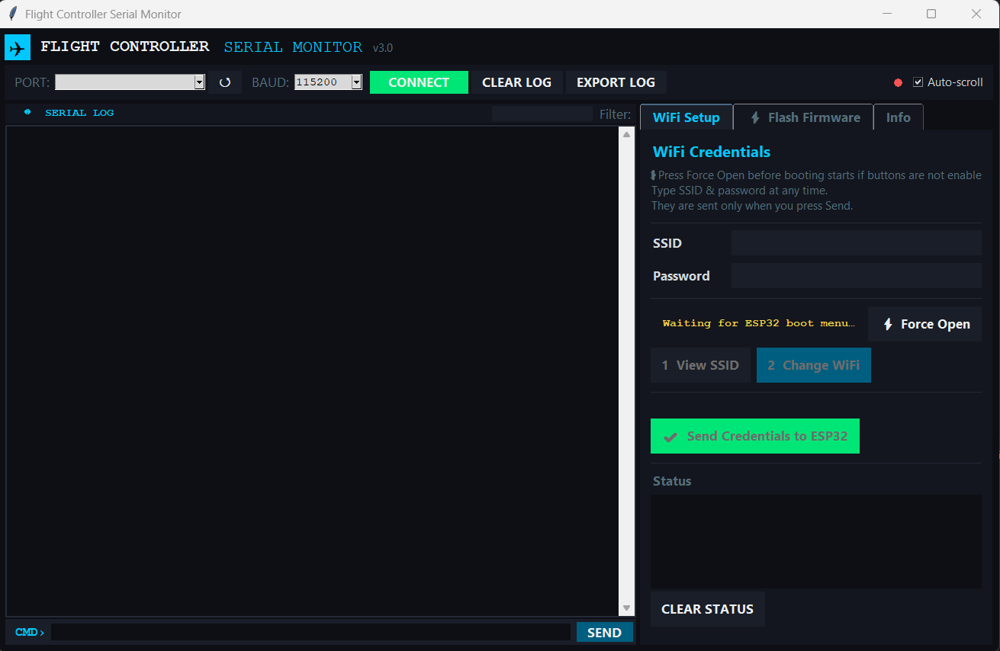
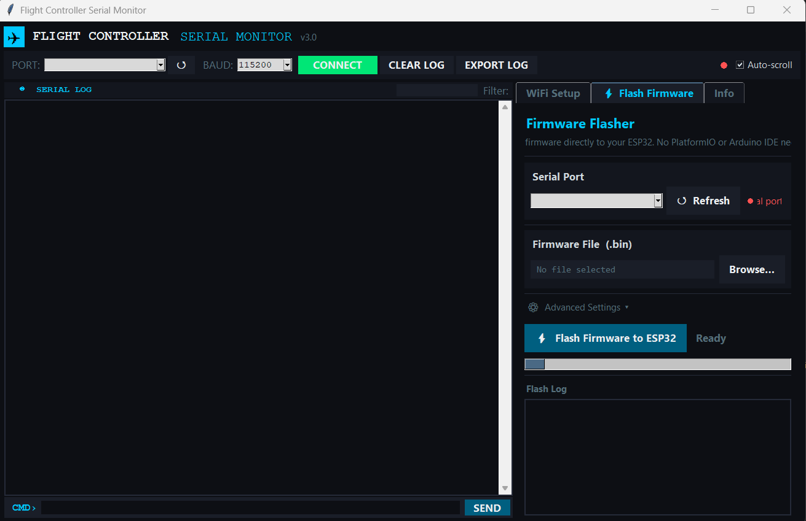

# GCSHelper — Flash Tool and Serial Monitor

Small desktop tool for getting firmware onto the ESP32 and watching what it prints, without installing the Arduino IDE or PlatformIO. Python with tkinter, using esptool and pyserial underneath.




## Features

Flash tab:

- Scans the COM ports and pre-selects the ESP32 by matching the usual USB-serial chips (CP210x, CH340)
- File browser for picking a compiled `.bin`
- One click runs esptool with the right parameters (chip esp32, DIO, 40 MHz, 4 MB)
- esptool output streams live into a colour-coded log; errors and warnings stand out
- On failure you get a clear message and can retry right away; on success the ESP32 reboots into the new firmware

Serial monitor tab:

- Connects to any port at a selectable baud rate (115200 by default)
- Scrolling live view of everything the firmware prints: boot messages, calibration, WiFi status
- A text field to send commands to the firmware, which also works for the boot-time WiFi credential menu
- Log export to a text file

## Running

```
pip install pyserial esptool
python flight_serial_monitor_gui.py
```

There is also a packaged Windows build (PyInstaller plus an Inno Setup installer), so end users don't need Python at all.

## Typical use

1. Plug in the ESP32; the port should already be selected
2. Pick the firmware `.bin` and press Flash, watch the log
3. Switch to the monitor tab to watch the boot sequence
4. Optionally press a key in the first 10 seconds of boot and set the WiFi credentials through the serial menu
5. Close this tool and switch to the GCS for tuning over WiFi

## Implementation notes

esptool runs as a subprocess and its output is piped through a queue to the UI thread, so the window stays responsive during the whole flash. Serial reading also runs on a background thread. Flashing and monitoring never fight over the port: the monitor connection is closed before esptool starts and reopened afterwards.
