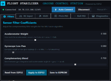
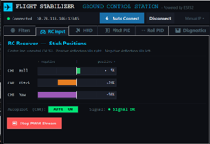
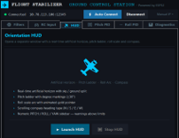
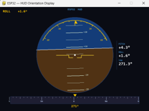
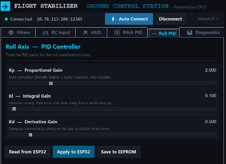
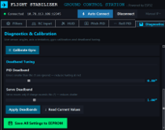
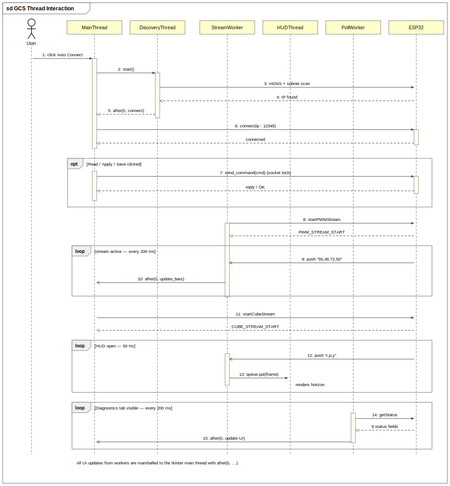

# FlightGCS - Ground Control Station

Desktop application for configuring and monitoring the flight stabilizer over WiFi. Written in Python: tkinter for the UI, pygame for the live HUD.









## Features

- Auto Connect: finds the ESP32 through mDNS (`esp32.local`) and a subnet scan running at the same time, whichever answers first wins
- Six tabs: Filters, RC Input, HUD, Pitch PID, Roll PID, Diagnostics
- Filter coefficients and PID gains are adjusted with sliders and applied to the running firmware immediately
- Live HUD in a separate pygame window: artificial horizon, pitch ladder, roll arc, compass tape, fed by the 50 Hz attitude stream
- RC monitor with centre-zero bars for all four channels at 5 Hz
- Diagnostics: live angles polled every 200 ms, axis swap/invert, gyro calibration, deadband tuning
- One click saves everything to the aircraft's EEPROM

<!-- Add a screenshot of the HUD here: -->
<!--  -->

## Running

```
pip install pygame
python main.py
```

Python 3.9 or newer. tkinter ships with Python on Windows. Connect with Auto Connect, or type an IP and port manually.

## How it's built

The main rule in this app: the tkinter main thread never blocks. Anything that could wait on the network runs in its own thread, and results are handed back to the UI with `after(0, ...)`, because tkinter is not thread-safe.



| Thread | Runs | Job |
|---|---|---|
| Main thread | always | tkinter mainloop, button handling, one-off commands (read / apply / save) |
| Discovery thread | during Auto Connect | mDNS lookup and subnet scan in parallel, reports the first IP found |
| Stream worker (PWM) | while the RC Input tab is open | receives the 5 Hz channel stream, updates the bars |
| HUD thread | while the HUD is open | pygame loop, reads attitude frames from a queue and draws the horizon |
| HUD stream worker | while the HUD is open | receives the 50 Hz attitude stream and fills the queue |
| Poll worker | while the Diagnostics tab is visible | sends getStatus every 200 ms and updates the readouts |

Why a poll worker instead of another stream: the diagnostics values (axis config, PID values, calibration offsets) only change when the user clicks something, so streaming them at 50 Hz would be pointless. The GCS just asks every 200 ms. And since each ask is a blocking request/response, it runs on its own thread; doing it on the main thread would freeze the UI on every poll.

There are three ways the GCS talks to the firmware:

1. Request/response for settings: lock the socket, drain stale bytes, send the command, read until newline, unlock. 2 second timeout so the UI can't hang
2. Push streams for the RC bars and the HUD: one start command, then the firmware pushes lines until told to stop
3. Polling for diagnostics: periodic getStatus

All three share a single TCP socket. A lock inside the connection class makes sure commands never interleave in the middle of a response.

The full command list with example replies is in [`docs/gcs_command_reference.xlsx`](../docs/gcs_command_reference.xlsx).

## File layout

```
Modularized_GUI_code/
├── main.py                app window, connection bar, notebook, status bar
└── gcs/
    ├── connection.py      thread-safe socket + auto-discovery
    ├── theme.py           colors, fonts, widget helpers
    ├── control_tab.py     Filters tab
    ├── pid_tab.py         PID tab (one class, used for pitch and for roll)
    ├── servo_tab.py       RC Input tab + PWM stream worker
    ├── visualizer_tab.py  HUD tab + stream worker
    ├── diagnostics_tab.py Diagnostics tab + poll worker
    └── hud.py             pygame HUD (own thread)
```

Some decisions behind this layout: theme.py is the only place colors and fonts are defined, so all tabs look the same. The PID tab is written once and instantiated twice with different commands for pitch and roll. Switching tabs starts and stops the PWM stream automatically so no stream keeps running invisibly. Closing the window goes through a cleanup path that stops the workers, joins the threads with timeouts and closes the socket.
