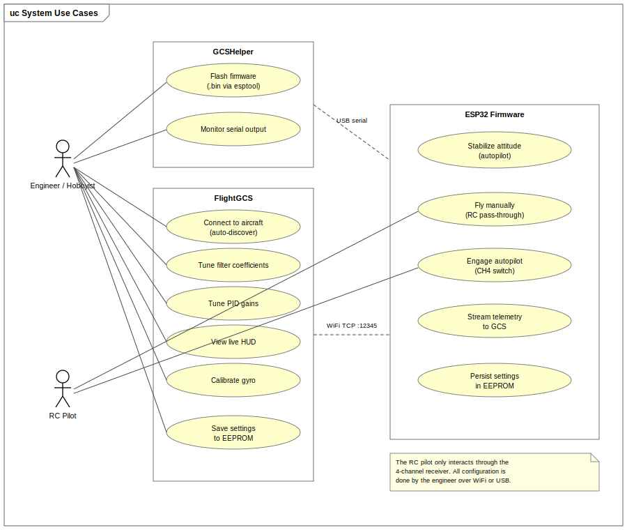
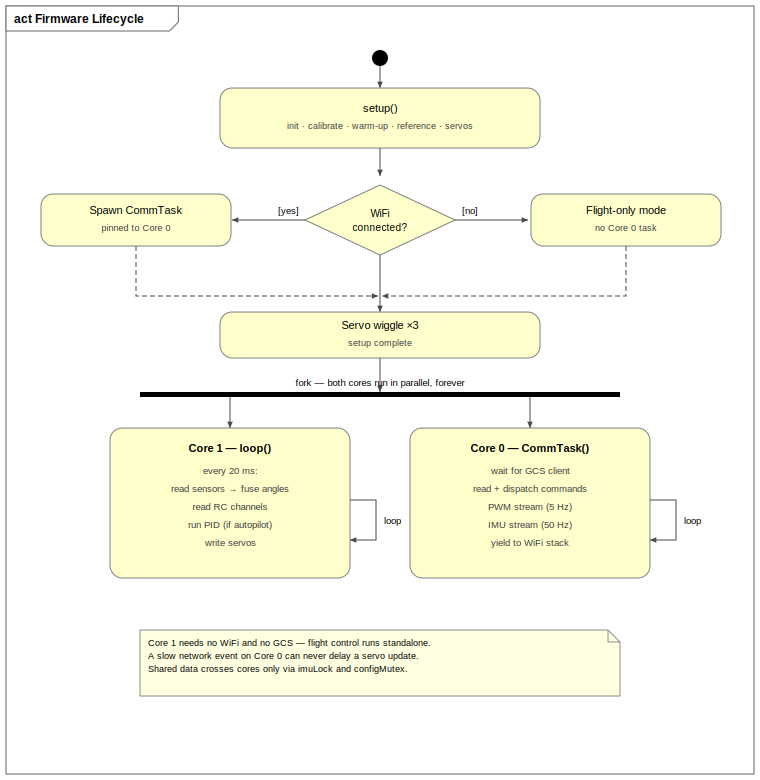
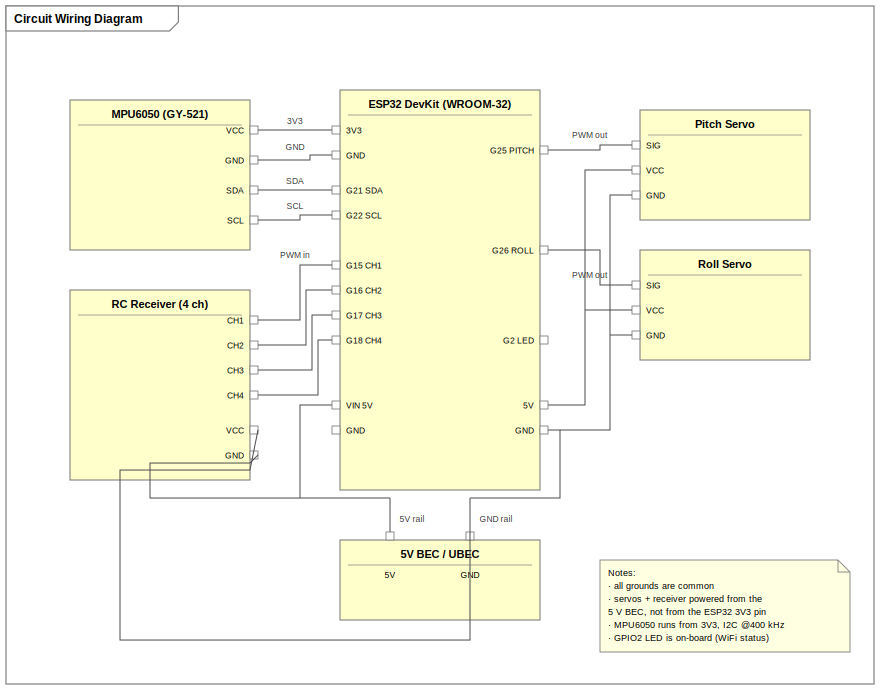

# ESP32 Based Flight Stabilizer

A flight stabilization system for fixed-wing RC aircraft, built around a dual-core ESP32. It comes with a Python ground control station (GCS) for tuning the aircraft over WiFi, and a small desktop tool for flashing firmware and watching serial output. I built this as my Master's thesis project in Embedded Systems Engineering at FH Dortmund.

<!-- Add a photo of the actual hardware / aircraft here: -->
<!--  -->

## Motivation

Cheap hobby gyros stabilize a plane fine, but you can't tune them without opening the plane and fiddling with trim pots or reflashing. Full flight controllers like Pixhawk or Matek boards do everything, but they cost a lot and are overkill if all you want is basic pitch/roll stabilization. I wanted something in between: a stabilizer that costs under 20 euros in parts and can be tuned live over WiFi from a laptop.

## What's in this repository

| Folder | What it is |
|---|---|
| `ESP32_FlightStabilizer_Firmware/` | C++ firmware. Core 1 runs a 50 Hz flight control loop (sensor fusion, PID, servos). Core 0 runs a TCP server for the GCS. |
| `Modularized_GUI_code/` | The ground control station. Python, tkinter for the UI, pygame for the live HUD. |
| `GCSHelper/` | Flash tool and serial monitor. Lets you flash a firmware .bin over USB without installing any toolchain. |
| `docs/` | UML diagrams, circuit diagram, and the command reference spreadsheet. |

The use case diagram below shows who uses what:



## How it works, briefly

1. On power-up the firmware calibrates the gyro, lets the sensor fusion filter settle, and stores the current level attitude as the autopilot reference. The plane has to sit still and level during this.
2. Core 1 then runs the flight loop at 50 Hz: read the MPU6050, fuse the angles with a complementary filter, run PID if autopilot is on, write the servos.
3. Core 0 handles all WiFi/TCP traffic with the GCS separately, so network delays can never slow down the control loop.
4. The pilot flies normally with a standard RC transmitter. Flipping channel 4 turns the autopilot on, which then holds the reference attitude.
5. From the GCS you can change PID gains, filter weights, deadbands and axis orientation while the firmware is running, and save everything to EEPROM.



## Hardware

### Parts

| Part | Purpose | Approx. cost |
|---|---|---|
| ESP32 DevKit (WROOM-32) | dual-core MCU with WiFi | ~6 € |
| MPU6050 breakout (GY-521) | accelerometer + gyroscope, I2C | ~3 € |
| 2x 9g servos (SG90 / MG90S) | elevator and aileron | ~4 € |
| 4-channel RC receiver | pilot input (PWM) | existing gear |
| 5V BEC | power for ESP32, servos, receiver | ~2 € |

### Wiring



| GPIO | Function |
|---|---|
| 21 / 22 | I2C SDA / SCL to MPU6050 (400 kHz) |
| 15, 16, 17, 18 | RC channels 1–4 (PWM in, interrupt-driven) |
| 25 | pitch servo (PWM out) |
| 26 | roll servo (PWM out) |
| 2 | onboard LED, WiFi status |

Servo output is clamped to 45°–135° in software as a safety limit. The servos and receiver are powered from the BEC, not from the ESP32's 3V3 regulator.

## Getting started

**1. Flash the firmware.** Either build and upload with PlatformIO / Arduino IDE from `ESP32_FlightStabilizer_Firmware/`, or use GCSHelper to flash a pre-built `.bin` over USB.

**2. First boot.** Keep the board level and still for the first ~5 seconds. The gyro calibration and the reference attitude capture happen in this window. A triple servo wiggle tells you setup is done. If you connect a serial terminal (115200) within the first 10 seconds, you can change the stored WiFi credentials without reflashing.

**3. Start the GCS.**

```
cd Modularized_GUI_code
pip install pygame
python main.py
```

Click Auto Connect. The GCS looks for the ESP32 with mDNS (`esp32.local`) and a subnet scan at the same time, then connects over TCP on port 12345.

**4. Tune.** Adjust filters and PID gains from the tabs, watch the HUD, and save to EEPROM when you're happy. Settings survive power cycles.

## Documentation

All diagrams are in `docs/diagrams/`:

| Diagram | File |
|---|---|
| Use case overview | [`use_case_overview.svg`](docs/diagrams/use_case_overview.svg) |
| Circuit wiring | [`circuit_diagram.svg`](docs/diagrams/circuit_diagram.svg) |
| Firmware lifecycle (boot → two cores) | [`firmware_lifecycle.svg`](docs/diagrams/firmware_lifecycle.svg) |
| Boot sequence, full detail | [`boot_sequence.svg`](docs/diagrams/boot_sequence.svg) |
| Flight control loop (Core 1) | [`flight_control_loop.svg`](docs/diagrams/flight_control_loop.svg) |
| Autopilot mode / control decision | [`mode_control_decision.svg`](docs/diagrams/mode_control_decision.svg) |
| Communication task (Core 0) | [`communication_task.svg`](docs/diagrams/communication_task.svg) |
| Cross-core data exchange (sequence) | [`cross_core_sequence.svg`](docs/diagrams/cross_core_sequence.svg) |
| GCS thread interaction (sequence) | [`gcs_thread_sequence.svg`](docs/diagrams/gcs_thread_sequence.svg) |

The full TCP command protocol is documented in a spreadsheet: [`docs/gcs_command_reference.xlsx`](docs/gcs_command_reference.xlsx).

## Author

Arjun - Masters Embedded Systems Engineering, FH Dortmund.